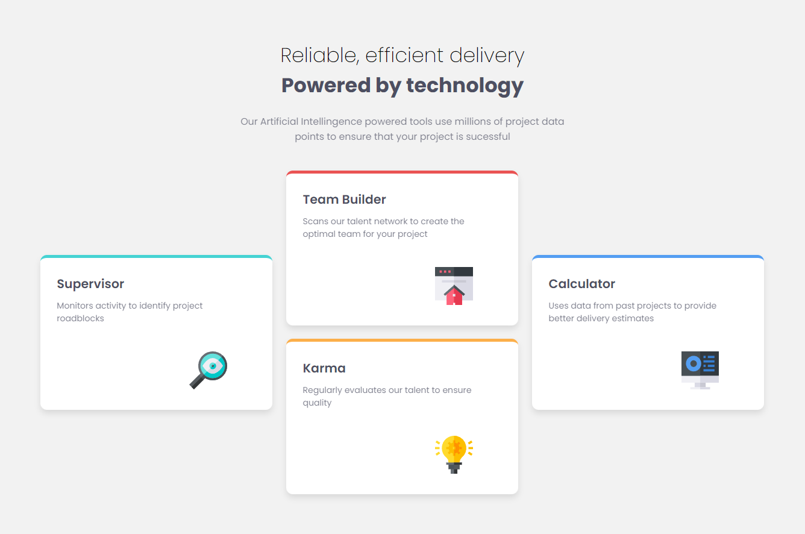

# pablodev - Four card feature section solution

This is a solution to the [Four card feature section challenge on Frontend Mentor](https://www.frontendmentor.io/challenges/four-card-feature-section-weK1eFYK). Frontend Mentor challenges help you improve your coding skills by building realistic projects. 

## Overview

### The challenge

Users should be able to:

- View the optimal layout for the site depending on their device's screen size

### Screenshot

### Links

- Solution URL: [Add solution URL here](https://github.com/Pabloodev/four-card-feature)
- Live Site URL: [Add live site URL here](https://your-live-site-url.com)

## My process

### Built with

- Semantic HTML5 markup
- Flexbox
- CSS Grid

### What I learned

I believe this solution was the one that added the most so far.

I only knew the flex-box and in a very mediocre way. Today I see that there is much more to do, and many ways to make your CSS better, something that makes sense for the user and browser!

I had the opportunity to gain some affinity with CSS grid.

### Continued development

I intend to continue my study with the cube CSS methodology, I really liked it and I believe it brings much more meaning to what it means to code in CSS, I intend to improve my lines, more and more!

## Author

- Website - [pablodev projects](https://pabloodev.github.io/portifolio-pablo/)
- Frontend Mentor - [@pablodev](https://www.frontendmentor.io/profile/Pabloodev)

Thanks for visit here! 😊

